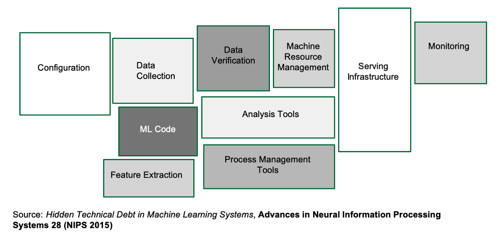

Machine learning promises to be transformational for many industries, ranging from financial services to healthcare to agriculture. The resurgence of machine learning, due to the astonishing performance of deep learning in computer vision and natural language processing, has prompted industry to jump on the bandwagon and use machine learning in their businesses. In fact, entire startups are being built around machine learning alone, promising that their new found algorithms will vastly improve their products and services.

While week-on-week new state of the art algorithms are being published, using them in a production setting is often non-trivial.
The additional complexity of using machine learning to power products cannot be understated. Many new factors become important in your system and oftentimes, development of machine learning models comprises a small part of the puzzle. This is highlighted in the paper, [Hidden Technical Debt in Machine Learning Systems](link), where they visualise the components of a production machine learning system revealing the true complexity of such systems.

When embarking on a journey to introduce machine learning into your product, it is important to be aware of this complexity and take it into consideration. In this blog post, I go over some of the challenges with reference to my own experiences. This is by no means the most comprehensive material and I will provide links to additional resources where needed.

## Technical Debt

## Data Quality

## Concept Drift

## Versioning

Versioning is an essential part of software engineering. Git has largely solved this problem for traditional software development. In machine learning, we not only have to version our code but also the parameters of our model and the data that was used to train the model.

Data versioning is a new challenge that machine learning brings to the table. Why is this important? Well let's walk through a scenario. Imagine a machine learning engineer, Daisy, creates a model with dataset A. She then uses the same model with slightly different data, dataset B. She repeats this two more times, making dataset's C and D. After all her experiments, she finds the model with datasets A and C performed the best. Unfortunately she never logged the differences between the datasets, only has the version with the latest changes (dataset D) and forgot all the changes between them. It is now impossible for her to reproduce her best performing model, a true tragedy. From this example, it is pretty evident why there is a need for data versioning.

As a new challenge, data versioning has not come of age yet. As of current time, there is no standard methodology or tooling to deal with this problem effectively. However, it is important to develop internal systems to track and version data. Being able to reproduce your experiments and to further improve them with the correct data is essential to using machine learning effectively.

Some of the tools that currently exist to solve this challenge are ...

## Experimental Infrastructure

## Code quality
